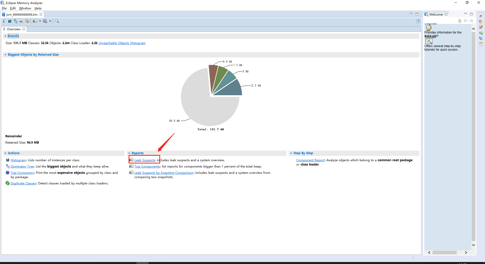
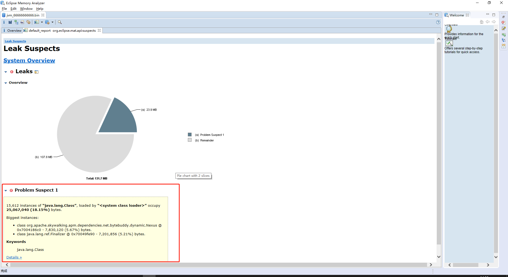

# JVM内存溢出排查

## 方法


查看主机内存情况

```bash
free -h
```

jps 命令找出java进程的PID 

```bash
jps
```

jstat 查询gc回收情况

```bash
jstat -gcutil PID 1s
```

[jstat用法请参考这个 ](https://lotabout.me/2018/QQA-Understanding-jstat-gc-output/){target="_blank"}

jmap dump出jvm内存

```bash
jmap -dump:live,format=b,file=/tmp/jvm_xxx.bin PID
```

把`jvm_xxx.bin`下载到本地计算机


下载 Eclipse Memory Analyzer（mat）

新版本的mat需要jdk11，建议下载老版本

[下载地址](https://www.eclipse.org/mat/){target="_blank"}


使用mat打开jvm_xxx.bin文件，mat会自动分析堆文件，分析完成之后点击`Leak Suspects`，一般就能看出哪些对象占用了大量内存

 

 


## 参考资料
- [QQA: jstat gcutil 的输出是什么意思](https://lotabout.me/2018/QQA-Understanding-jstat-gc-output/){target="_blank"}

